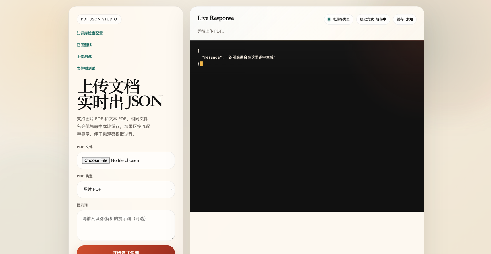
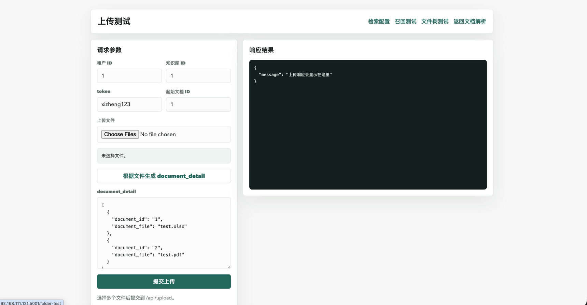
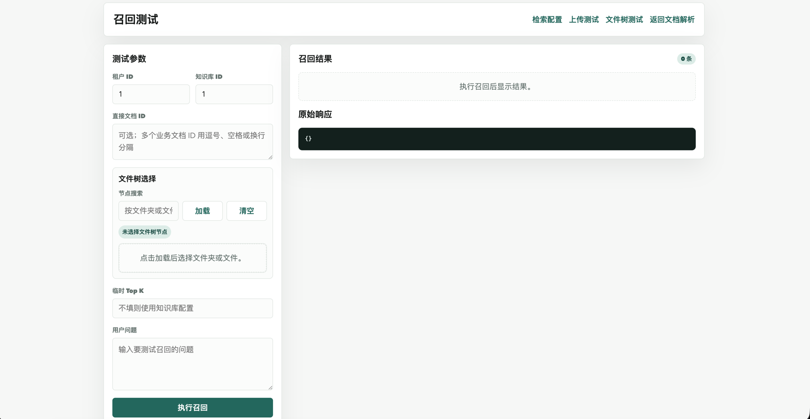
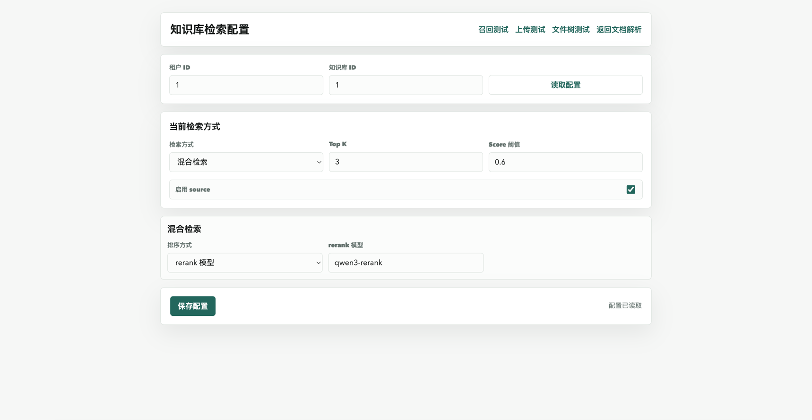
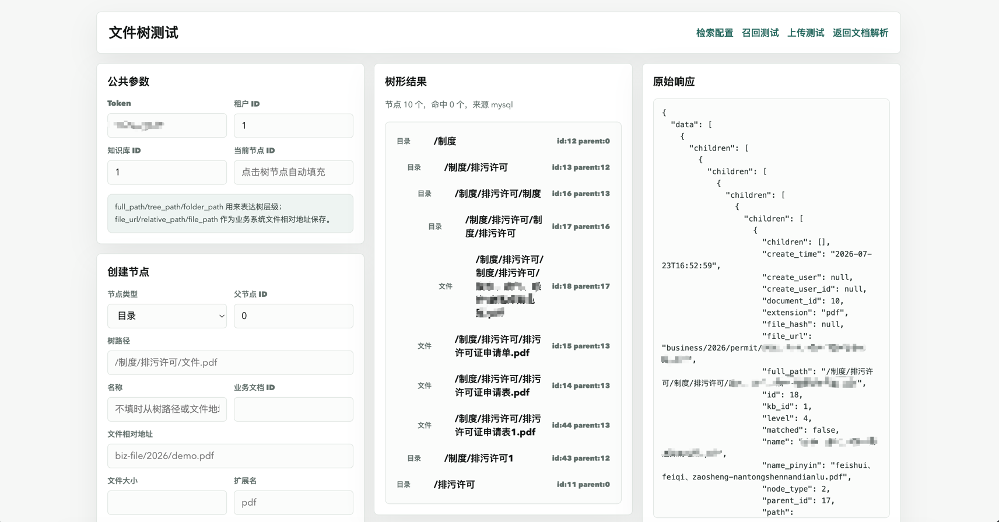
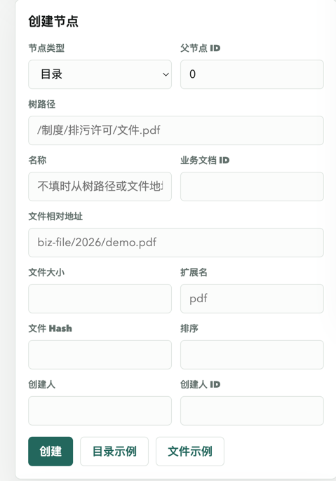
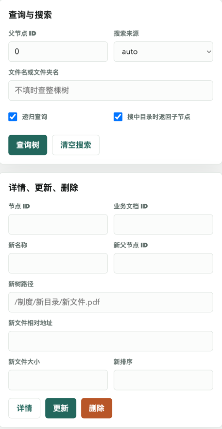

# 知识库 RAG 系统

面向saas法规场景的文档检索增强（RAG）后端服务。上传 PDF / Word / Excel / 文本等文档，
自动完成文本抽取、父子分段、向量入库，并提供多租户的混合检索（向量 + 全文 + Rerank）能力。

基于 **Flask + Milvus + Elasticsearch + MySQL**，对接阿里云 **DashScope**（通义千问 / 多模态 Embedding / Rerank），
OCR 使用 **PaddleOCR**。

---

## ✨ 功能特性

### 文档处理
- **多格式解析**：PDF（文本型 / 扫描型）、Word/Excel/PPT（通过 textract）、Markdown / 纯文本
- **PDF OCR**：扫描件 / 图片型 PDF 走 PaddleOCR 版面识别，支持结果缓存，避免重复识别
- **结构化信息抽取**：上传时可附带 `document_detail`，由通义千问抽取法规名称、行业、污染物、处罚措施等元数据
- **父子分段**（Parent-Child Chunking）：
  - 识别 `第X章` / `第X条` 等法规结构，按章节 / 条目切分
  - Markdown 表格、HTML 表格整体保留，不破坏表格语义
  - 父分段粗粒度、子分段细粒度，子段命中后可回溯父段上下文
- **异步入库**：上传接口即时返回，后台线程池并行完成「解析 → 分段 → 向量化 → 双写索引」

### 检索
- **三种检索模式**：`VECTOR`（向量）、`FULLTEXT`（ES 全文）、`HYBRID`（混合）
- **混合策略**：
  - `RERANK`：向量 + 全文各取候选，用 `qwen3-rerank` 重排
  - `WEIGHT`：按语义 / 关键词权重融合打分
- **多租户隔离**：Milvus `partition_key` 按 `tenant_id` 物理隔离，ES 按 `tenant_id` + `kb_id` 过滤
- **检索范围解析**：可按文档 / 文件夹限定检索范围（支持文件夹树递归）
- **检索配置**：每个 `tenant_id × kb_id` 可独立保存检索参数（模式、权重、top_k、阈值等）

### 工程化
- **多模型加权**：`MODEL_CONFIG_JSON` 支持配置多个通义千问模型 + token 按权重轮换，分摊配额
- **批量向量 + 限速 + 重试**：Embedding 调用自动分批、限速、失败重试
- **Token 鉴权**：上传 / 解析接口走 `token` Header 校验，失败请求脱敏记录
- **Web 控制台**：内置登录页、检索测试、上传测试、文件夹测试、检索配置页面

> 法规结构感知的父子分段（保留表格语义、子段回溯父段上下文）+ 双路归一化混合检索（向量/全文/重排可配）+ 全链路多租户隔离 + 异步事件驱动入库管线，面向环保合规场景的工业级 RAG 后端。

---

## 🖼️ 界面预览

| 登录页 | PDF 转 JSON | 上传文件 |
|:---:|:---:|:---:|
|  |  |  |

| 召回测试 | 检索配置 | 文件树测试 |
|:---:|:---:|:---:|
|  |  |  |

<details><summary>更多文件树测试截图</summary>

| 文件树测试 2 | 文件树测试 3 |
|:---:|:---:|
|  |  |

</details>

---

## 🏗️ 系统架构

```
┌──────────────┐   上传    ┌──────────────────────────────────────────────┐
│  Web / API   │ ───────▶ │            UploadService (异步)               │
│  (Flask)     │           │  解析 → 父子分段 → Embedding → 双写索引      │
└──────┬───────┘           └──────────────┬───────────────────────────────┘
       │ 检索                              │
       ▼                                   ▼
┌──────────────┐   向量    ┌────────────────────┐   全文   ┌──────────────────┐
│RetrievalSvc  │◀─────────│      Milvus        │         │  Elasticsearch   │
│  (Hybrid +   │  Rerank   │  (向量 + 多租户)   │         │ (ik 分词 + 全文)  │
│   Rerank)    │◀─────────│                    │         │                  │
└──────────────┘           └────────────────────┘         └──────────────────┘
       │                                                            │
       ▼                                                           
┌──────────────┐  元数据   ┌────────────────────┐                   
│   MySQL      │◀─────────│  kb_document 等   │                   
│  (文档/分段/  │          │                    │                   
│   元数据表)   │          └────────────────────┘                   
└──────────────┘                                                  
       │ DashScope API                                             
       ▼                                                           
   通义千问 / multimodal-embedding / qwen3-rerank                  
```

### 目录结构

```
.
├── main.py                     # 入口
├── app/
│   ├── __init__.py             # create_app，装配各 service
│   ├── api/                    # 路由层（upload / search / pdf / folder / retrieval_config / web）
│   ├── core/                   # 配置、数据库、鉴权、多模型 token
│   ├── repositories/           # MySQL 数据访问（文档 / 文件夹 / 检索配置）
│   ├── services/               # 业务层（解析、分段、向量、索引、检索、文件夹）
│   ├── templates/              # Web 控制台页面
│   └── test/                   # 测试
├── model/
│   ├── paddleocr_model/        # PaddleOCR 版面识别封装 + 缓存
│   └── qwen/                   # 通义千问结构化抽取封装
├── config/                     # ES / Milvus 客户端
├── docker/                     # ES / Kibana / Milvus 部署脚本（见 docker/README.md）
├── mysql/init.sql              # MySQL 建表脚本
├── init_milvus.py              # Milvus Collection / 索引初始化
└── requirements.txt
```

---

## 🚀 快速开始

### 1. 前置依赖

| 组件 | 版本/说明 |
|------|-----------|
| Python | 3.9+ |
| MySQL | 8.x |
| Elasticsearch | 8.x，需安装 [IK 分析器插件](https://github.com/medcl/elasticsearch-analysis-ik) |
| Milvus | 2.4+（Standalone） |
| DashScope API Key | 阿里云百炼控制台获取 |

ES、Kibana 与 Milvus 可用 `docker/` 下的脚本一键启动（各文件职责见 [docker/README.md](docker/README.md)）：

```bash
# Elasticsearch（含数据/插件卷、单节点）
bash docker/elasticsearch.sh

# Kibana（依赖上方 ES 创建的 es-net 网络与 es 容器，需先启动 ES）
bash docker/kibana.sh

# Milvus（etcd + minio + milvus）
docker compose -f docker/milvus-compose.yml up -d
```

### 2. 安装依赖

```bash
python -m venv .venv && source .venv/bin/activate
pip install -r requirements.txt
```

### 3. 配置环境变量

```bash
cp .env.example .env
# 编辑 .env，填写 MySQL / ES / Milvus / DashScope 密钥等
```

关键字段：

| 变量 | 说明 |
|------|------|
| `DASHSCOPE_API_KEY` | 阿里云 DashScope 密钥（Embedding / Rerank / 通义千问） |
| `MYSQL_*` | MySQL 连接 |
| `ES_URL` / `ES_USERNAME` / `ES_PASSWORD` | Elasticsearch 连接 |
| `MILVUS_HOST` / `MILVUS_PORT` | Milvus 连接 |
| `ACCESS_PASSWORD` | Web 控制台登录密码 |
| `API_TOKEN` | 接口 `token` Header 校验值 |
| `FLASK_SECRET_KEY` | Flask session 密钥 |
| `MODEL_CONFIG_JSON` | 多模型加权配置（见下） |
| `PADDLE_VL_SERVER_URL` | PaddleOCR VL 推理服务地址 |

### 4. 初始化数据库与向量库

```bash
# MySQL 建表
mysql -u<user> -p<password> < mysql/init.sql

# Milvus Collection + 索引
python init_milvus.py
```

ES 索引 mapping 见 [docker/elasticsearch-mapping.md](docker/elasticsearch-mapping.md)（`kb_chunk_index` 与 `kb_file_tree_index`）。

### 5. 启动服务

```bash
python main.py
# 默认监听 0.0.0.0:5001，浏览器访问 http://localhost:5001
```

---

## 📡 API 一览

所有需要鉴权的接口要求请求头携带 `token: <API_TOKEN>`。

| 方法 | 路径 | 鉴权 | 说明 |
|------|------|------|------|
| `GET` | `/` | session | 首页 / 控制台 |
| `GET` / `POST` | `/login` / `/check-password` | - | 登录 |
| `GET` | `/upload-test` | session | 上传测试页 |
| `POST` | `/api/upload` | token | 上传文档（异步解析入库） |
| `GET` | `/retrieval-test` | session | 检索测试页 |
| `POST` | `/api/search` | - | 混合检索 |
| `POST` | `/api/parse-pdf` | token | PDF 解析（结构化抽取） |
| `POST` | `/api/parse-pdf-stream` | token | PDF 解析（流式 NDJSON） |
| `GET` | `/retrieval-config` | session | 检索配置页 |
| `GET` / `PUT` | `/api/retrieval-config` | session | 读取 / 保存检索配置 |
| `GET` / `POST` | `/api/folder_tree` 等 | token | 文件夹树增删改查 |

### 上传示例

```bash
curl -X POST http://localhost:5001/api/upload \
  -H "token: $API_TOKEN" \
  -F "tenant_id=1" \
  -F "kb_id=1" \
  -F "files=@某法规.pdf" \
  -F 'document_detail=[{"document_id":"doc_1","title":"某法规"}]'
```

### 检索示例

```bash
curl -X POST http://localhost:5001/api/search \
  -H "Content-Type: application/json" \
  -d '{"query":"COD排放标准","tenant_id":"1","kb_id":"1","top_k":5}'
```

---

## ⚙️ 多模型加权配置

当单账号配额不足时，可配置多个通义千问模型 + token 按权重轮换。在 `.env` 中：

```json
MODEL_CONFIG_JSON='[
  {"model":"qwen-max","token":"sk-xxx1","weight":10},
  {"model":"qwen-plus","token":"sk-xxx2","weight":3}
]'
```

留空（`[]`）时回退到 `QWEN_MODEL` + `DASHSCOPE_API_KEY`。

---


## 📄 License

本项目仅作为内部合规知识库后端参考实现，如需商用请确认所用模型与服务（DashScope / PaddleOCR 等）的许可与计费条款。
